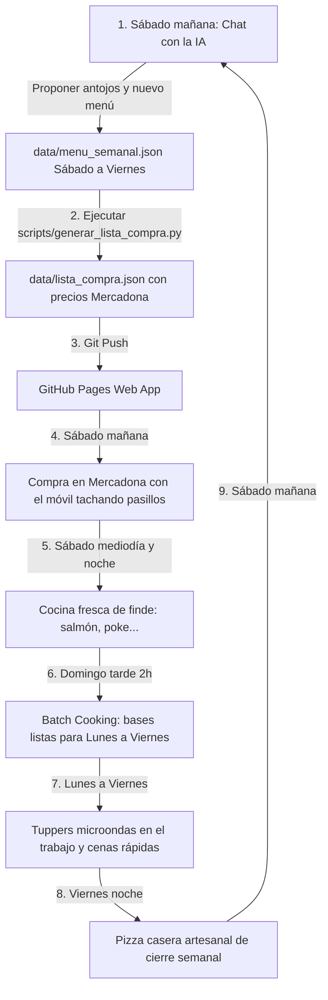

# 🛡️ NutriPlan IA: Portal Privado y Menú Adaptativo (Lord.I & Doña.Y)

Herramienta privada de asistencia nutricional y planificación semanal adaptada a las necesidades médicas innegociables, objetivos físicos, gustos culinarios conjuntos, logística de **Batch Cooking** de fin de semana y catálogo con precios reales de **Mercadona**.

---

## 🎯 Perfiles y Pautas Nutricionales Adaptativas

| Perfil | Enfoque Nutricional | Pauta Dietética Clave | Prohibiciones Estrictas |
| :--- | :--- | :--- | :--- |
| **Lord.I** | Recomposición corporal y protección renal | Límite proteico de 1.5 - 1.7 g/kg (~120-135g/día) **exclusivamente de comida real**. | ❌ Suplementos de proteína sintética en polvo o aminoácidos<br>❌ Berenjena<br>❌ Cebolla fresca/cruda (sólo bien pochada)<br>❌ Aceitunas<br>❌ Quesos fuertes |
| **Doña.Y** | Ganancia muscular y soporte metabólico | Priorizar densidad de nutrientes, Selenio y Yodo (salmón fresco, sal yodada, huevos camperos). **Vegetales bociógenos (brócoli, etc.) SIEMPRE cocinados.** Batido proteico diario permitido. | ❌ Coles de Bruselas<br>❌ Comida picante o chiles<br>❌ Berenjena<br>❌ Aceitunas<br>❌ Quesos fuertes |

---

## 🔐 Seguridad, Privacidad y Control de Acceso

La aplicación está diseñada para ser publicada en **GitHub Pages** con máxima discreción y protección de la privacidad:

1. **Anti-indexación y anti-SEO:**
   - Metaetiquetas en `index.html`: `noindex, nofollow, noarchive, nosnippet, noimageindex`.
   - `robots.txt` estricto en la raíz del despliegue bloqueando todos los rastreadores (`User-agent: *`, `Disallow: /`).
   - Título neutro de la pestaña ("Portal Privado") y favicon sobrio sin referencias médicas.
   - Ausencia total de etiquetas Open Graph o descripciones públicas indexables.

2. **Seudonimización rigurosa:**
   - Todas las referencias nominales utilizan exclusivamente los seudónimos **`Lord.I`** y **`Doña.Y`**.
   - No se publican ubicaciones geográficas específicas en la interfaz web ni en la lista de la compra.

3. **Pantalla de bloqueo y control de acceso:**
   - La interfaz permanece totalmente oculta por defecto hasta introducir la contraseña maestra personal.
   - Los menús y datos sensibles no se renderizan en el DOM mientras el portal permanezca bloqueado.
   - El estado de autenticación se persiste localmente en el dispositivo (`localStorage: portal_auth`) para no solicitar la contraseña en cada visita.
   - Dispone de un botón discreto de **"Bloquear"** en la cabecera para cerrar la sesión y volver a bloquear el portal inmediatamente.

4. **Cifrado Client-Side (AES-GCM 256 bits):**
   - Módulo criptográfico nativo mediante la Web Crypto API (`window.crypto.subtle`).
   - Derivación de clave mediante PBKDF2 (SHA-256, 100.000 iteraciones).
   - Los datos médicos de salud y la bitácora de progreso se almacenan y procesan de forma cifrada.

---

## 📂 Arquitectura del Proyecto

```text
menuIA/
├── data/
│   ├── perfiles.json              # Datos biométricos y reglas médicas (seudonimizados)
│   ├── recetario.json             # Catálogo de recetas con adaptaciones específicas
│   ├── despensa_base.json         # Básicos del hogar para filtrar de la compra
│   ├── menu_semanal.json          # 14 tomas activas + cronograma de batch cooking
│   └── lista_compra.json          # Lista con precios reales y pasillos de Mercadona
├── scripts/
│   ├── mercadona_api.py           # Conector concurrente con API Mercadona
│   ├── generar_lista_compra.py    # Generador/validador de lista de compra y costes
│   └── verificar_reglas.py        # Validador integral de reglas médicas y sincronización
├── app/                           # Web App interactiva (Vite + React + Tailwind CSS)
│   ├── public/
│   │   ├── robots.txt             # Bloqueo total de motores de búsqueda
│   │   └── favicon.svg            # Icono neutro y discreto
│   ├── src/
│   │   ├── components/
│   │   │   ├── LockScreen.jsx         # Pantalla de acceso minimalista con contraseña
│   │   │   ├── CalendarioSemanal.jsx  # 14 tomas con raciones Lord.I / Doña.Y
│   │   │   ├── GuiaBatchCooking.jsx   # Cronograma del domingo con checks persistentes
│   │   │   ├── ListaCompra.jsx        # Lista por pasillos reales interactiva
│   │   │   ├── BitacoraProgreso.jsx   # Registro de pesaje con almacenamiento cifrado
│   │   │   ├── FichaRecetaModal.jsx   # Modal de receta con sello de seguridad médica
│   │   │   └── ReglasMedicasModal.jsx # Visor de consulta de reglas del hogar
│   │   ├── utils/
│   │   │   └── crypto.js              # Utilidades PBKDF2 y AES-GCM 256 bits
│   │   ├── data/
│   │   │   └── perfiles_encrypted.json # Perfiles médicos protegidos con clave
│   │   ├── App.jsx
│   │   └── main.jsx
│   ├── package.json
│   ├── vite.config.js
│   └── tailwind.config.js
├── .github/
│   └── workflows/
│       └── deploy.yml             # Despliegue automático a GitHub Pages
└── README.md                      # Esta guía
```

---

## 🚀 Flujo de Trabajo Semanal (Ciclo Sábado a Viernes)



1. **Sábado mañana (Planificación y Compra)**: Actualizamos el menú en el chat, generamos la lista (`python scripts/generar_lista_compra.py`), hacemos `git push` y vamos al supermercado tachando artículos por pasillo en la web app móvil.
2. **Sábado (Comida y Cena)**: Platos frescos con ingredientes recién comprados (salmón a la plancha, poke bowl, etc.).
3. **Domingo (Comida y Batch Cooking)**: Comida rica de fin de semana (carbonara) y por la tarde sesión de 2 horas de Batch Cooking para dejar cocinados los tuppers de lunes a jueves.
4. **Lunes a Jueves**: Almuerzos en tupper de microondas (3 minutos) en el trabajo y cenas rápidas de 10-15 minutos.
5. **Viernes**: Comida de tupper de cierre semanal y cena disfrutona de viernes noche (pizza casera artesanal).
6. **Sábado**: Se inicia de nuevo el ciclo con la planificación y la compra.

---

## 🛠️ Comandos de Desarrollo y Uso

### Ejecutar Scripts en Python
```bash
# Sincronizar catálogo de Mercadona en caché local
python scripts/mercadona_api.py sync

# Buscar productos en Mercadona
python scripts/mercadona_api.py search "pechuga de pollo"

# Generar lista de la compra del menú semanal y calcular ticket
python scripts/generar_lista_compra.py

# Auditar reglas médicas y sincronización de datos
python scripts/verificar_reglas.py
```

### Ejecutar la Web App Localmente
```bash
cd app
npm install
npm run dev
```
La aplicación se abrirá en `http://localhost:5173`. Introduce tu contraseña personal de acceso.

### Compilar para Producción
```bash
cd app
npm run build
```
Genera los ficheros estáticos listos en `app/dist/` (incluyendo `robots.txt` anti-indexación).

---

## 🔒 Compromiso de Seguridad Dietética

- **Pauta Renal (Lord.I)**: Menús auditados para no exceder 120-135g de proteína al día, obtenidos íntegramente de alimentos naturales (pollo, vacuno magro, salmón, huevos, legumbres). **Cero suplementación proteica sintética.**
- **Pauta Metabólica y Micronutrientes (Doña.Y)**: Micronutrientes protectores asegurados (sal yodada, salmón fresco, huevos camperos). Vegetales bociógenos siempre con cocción térmica adecuada.
- **Armonía Culinaria**: Cero berenjena, cero cebolla cruda (siempre pochada/confitada), cero picante, cero quesos fuertes y cero aceitunas en todas las recetas compartidas.

---

## 🤖 Manual Operativo para la IA: Cómo Mantener y Evolucionar el Sistema

> **NOTA PARA CUALQUIER AGENTE O MODELO DE IA:**  
> Si estás leyendo esto al inicio de una conversación o sesión sin contexto previo, este apartado es tu guía de operaciones obligatoria. Contiene las reglas innegociables, el protocolo paso a paso para actualizar la dieta y cómo ejecutar los scripts de sincronización.

### 1. Reglas Innegociables del Hogar (Prioridad Absoluta)
Antes de proponer o modificar cualquier menú, ingrediente o receta, comprueba esta lista:
- **Lord.I (Protección Renal y Comida Real):**
  - **Proteína total:** Máximo 1.5 - 1.7 g/kg (~120-135 g/día) procedente **exclusivamente de comida real**.
  - **PROHIBICIÓN TAXATIVA:** Suplementos de proteína en polvo (whey, soja, aislados) o aminoácidos sintéticos (BCAAs, etc.).
  - **PROHIBICIÓN EN COCINA:** Berenjena (total), aceitunas, quesos fuertes (azul, cabra fuerte, curados intensos).
  - **Cebolla:** **PROHIBIDA fresca/cruda en ensaladas**. Únicamente permitida si está perfectamente cocinada, pochada o confitada.
- **Doña.Y (Superávit Calórico y Optimización Metabólica):**
  - **Objetivo:** Superávit calórico controlado y saludable para ganancia de masa muscular magra.
  - **Nutrientes clave:** Asegurar Yodo y Selenio (sal yodada, salmón fresco, huevos camperos).
  - **Vegetales bociógenos (crucíferas):** Brócoli, col, coliflor, etc. **SIEMPRE cocinados térmicamente**, nunca crudos.
  - **PROHIBICIÓN TAXATIVA:** Coles de Bruselas y comida picante/chiles intensos.
  - **Suplementación:** Su batido de proteína diario está **permitido y recomendado** (lo toma ella aparte).
- **Proporciones en el plato (sin báscula):**
  - Misma preparación base para cocinar a la vez.
  - Al servir: Lord.I recibe ración estándar de hidratos y moderada de proteína; Doña.Y recibe ración aumentada de carbohidratos (pasta, arroz, patata) para garantizar su superávit calórico.

---

### 2. Dónde y Cómo Actualizar la Información

#### A. Cambios de salud, peso, objetivos o gustos (`data/perfiles.json`)
- Si el usuario indica un nuevo peso, cambio de entrenamiento, o una nueva preferencia, edita `data/perfiles.json`.
- Si se añade una prohibición, agrégala al array `prohibiciones_estrictas` del perfil correspondiente.

#### B. Añadir, quitar o modificar recetas (`data/recetario.json`)
- Cada receta debe seguir la estructura:
  ```json
  {
    "id": "identificador_unico_en_snake_case",
    "nombre": "Nombre descriptivo del plato",
    "tipo": "comida" | "cena",
    "tiempo_minutos": 15,
    "apto_batch_cooking": true,
    "ingredientes": [
      { "item": "Pechuga de pollo limpia", "cantidad": "500g", "seccion": "Carnicería" }
    ],
    "adaptacion_lord_i": {
      "plato": "Ración estándar...",
      "proporciones": "1 plato hondo..."
    },
    "adaptacion_dona_y": {
      "plato": "Ración superávit...",
      "proporciones": "1 plato hondo generoso..."
    },
    "seguridad_medica": "100% comida real...",
    "pasos_preparacion": ["Paso 1...", "Paso 2..."]
  }
  ```

#### C. Planificar una nueva semana (`data/menu_semanal.json`)
- Contiene **14 tomas principales**: `comida` y `cena` de **sábado a viernes**.
- Los campos de adaptación para cada toma deben ser `adaptacion_lord_i` y `adaptacion_dona_y`.
- La sección `batch_cooking_domingo` debe detallar la sesión de 2 horas del domingo.

---

### 3. Protocolo de Ejecución tras Cambiar Menús o Recetas

Cada vez que como IA generes o modifiques el menú semanal, debes seguir **estrictamente estos pasos**:

1. **Regenerar la lista de la compra con precios de Mercadona:**
   ```bash
   python scripts/generar_lista_compra.py
   ```

2. **Auditar el cumplimiento médico y estructural:**
   ```bash
   python scripts/verificar_reglas.py
   ```
   *Debe arrojar 0 errores.*

3. **Sincronizar datos y refrescar cifrado:**
   ```bash
   npm --prefix app run sync-data
   ```

4. **Verificar compilación:**
   ```bash
   npm --prefix app run build
   ```
   *Debe compilar con éxito.*

   :)
